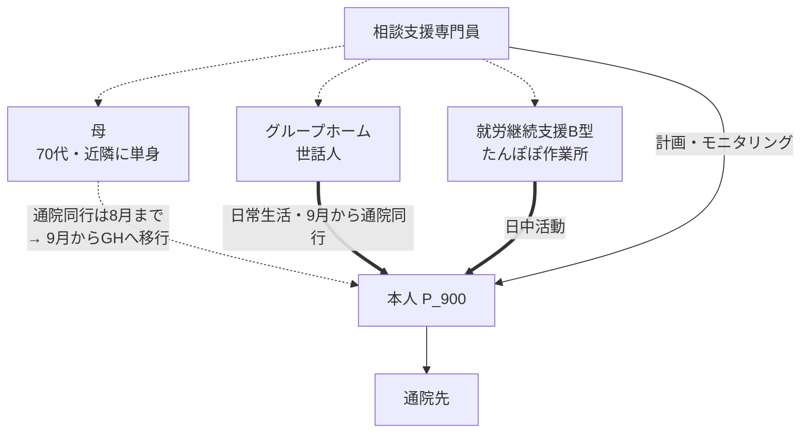

# 支援ネットワーク（2026-08 時点）

> **これは「その時点の姿」の保存である。** 現在の関係の正本は構造化DB側にある（→ `docs/dual-intake-routing.md` §3 の16）。このページの価値は、**後から「あのころはこうだった」と振り返れる**ことにある。

## この時点の要点

- **母が担ってきた通院同行が、2026年9月にグループホーム世話人へ移る移行期にあたる**（→ [[MT_2026-07-15_サービス担当者会議_P_900]]）
- 母は近隣に単身。年2回の主治医面談には引き続き同席する
- 金銭管理・衣類の入替えは**まだ母が担っており、移行先は未定**（次の課題）

## 移行の警戒

母が担う役割の一覧と代替可能性は構造化DB側（CareRole / CAN_BE_PERFORMED_BY）が正本。ここでは**移行のタイミングと、そこに込めた判断**を残す。
